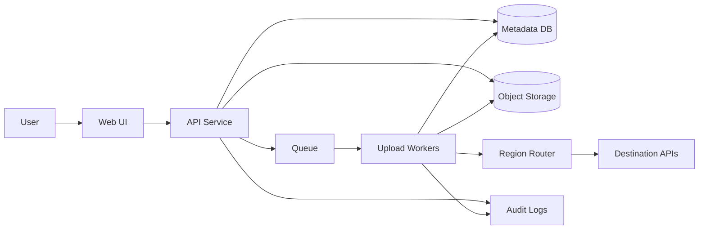

## High-Level Architecture

```mermaid
flowchart LR
    User[User] --> UI[Web UI]
    UI --> API[API Service]
    API --> DB[(Metadata DB)]
    API --> S3[(Object Storage)]
    API --> Q[Queue]

    Q --> W[Upload Workers]
    W --> S3
    W --> R[Region Router]
    R --> D[Destination APIs]

    W --> DB
    API --> L[Audit Logs]
    W --> L
```
