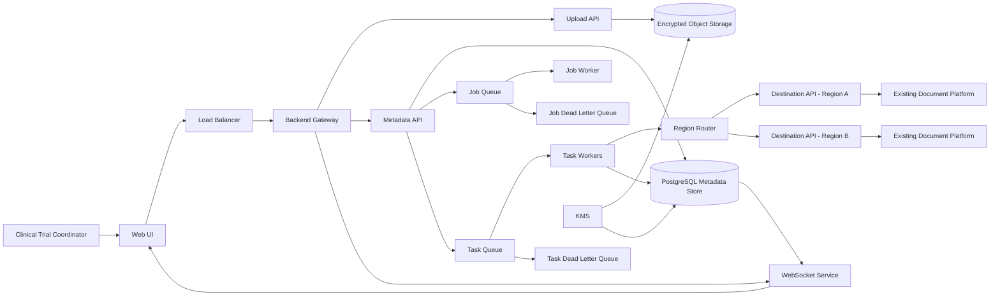

# DocBridge Blueprint

| Field | Value |
|---|---|
| Document Type | Stage 1 Blueprint |
| Status | Draft |
| Last Updated | June 2026 |

### Change Log

| Version | Changes | Date | Author |
|---|---|---|---|
| 1 | Initial Draft | May 2026 | P |
| 2 | Incorporated review feedback, clarified P0/P1 scope, added high-level architecture, UI/UX, resolved open questions, regional support, WebSocket updates, and retry strategy | June 2026 | P |

---

# 1. Executive Summary

DocBridge is a document upload orchestration platform designed to simplify clinical document distribution.

Clinical trial coordinators currently upload documents manually across hospitals, teams, binders, and folders. This creates repetitive work, operational risk, and poor visibility into upload status.

DocBridge allows users to upload files through a centralized workflow, select destinations, submit upload jobs, track progress, retry failures, and audit delivery status.

The initial release focuses on reliable single-destination upload workflows with asynchronous processing, real-time status visibility, and manual retry support.

Multi-destination upload support remains part of the broader product vision and is planned for P1.

DocBridge acts as an orchestration layer above existing document management systems and does not replace destination repositories.

---

# 2. Problem Statement

Clinical trial coordinators repeatedly upload documents into hospitals, teams, binders, and folders.

Today, this process is:

| Pain Point | Description |
|---|---|
| Manual | Users must repeatedly upload documents themselves |
| Repetitive | Similar upload actions are performed many times |
| Error-prone | Files can be uploaded to the wrong location |
| Hard to monitor | Users lack centralized status visibility |
| Hard to recover | Failed uploads require manual investigation |
| Operationally risky | Missing or incorrect files can impact clinical operations |

As the number of studies, hospitals, folders, and documents grows, manual work increases linearly and creates reliability, compliance, and operational risks.

---

# 3. Goals

| Goal | Description |
|---|---|
| Simplify uploads | Provide a single workflow for uploading clinical documents |
| Improve visibility | Show job and task status in near real time |
| Improve reliability | Process uploads asynchronously through durable queues |
| Support recovery | Allow users to retry failed upload tasks |
| Preserve auditability | Track upload lifecycle events |
| Support regional routing | Route uploads based on destination region |
| Prepare for future expansion | Keep the architecture compatible with P1 multi-destination uploads |

---

# 4. Non-Goals

| Non-Goal | Reason |
|---|---|
| Replace existing document repositories | DocBridge is an orchestration layer |
| Build a new identity system | Existing authentication and team systems should be reused |
| Support cancellation in P0 | Users can wait for completion and delete if needed |
| Support multi-destination uploads in P0 | Planned for P1 |
| Support scheduled uploads in P0 | Future enhancement |
| Support advanced workflow automation in P0 | Future enhancement |

---

# 5. Proposed Solution

DocBridge provides a batch-oriented upload orchestration layer.

Users upload files, select a destination, submit a job, and monitor progress. The backend stores files securely, creates job and task metadata, pushes work into queues, and processes uploads asynchronously through workers.

Each upload task is tracked independently. Failed tasks expose error details and can be manually retried by the user.

Status updates are delivered to the frontend through WebSockets so users can monitor jobs while continuing other work.

---

# 6. Product Scope

## 6.1 In Scope for P0

| Capability | Description |
|---|---|
| File upload | Users can upload files from their local device |
| Drag and drop | Users can drag files into the upload workspace |
| Destination selection | Users select destination before submitting |
| Job creation | The system creates an upload job |
| Task creation | The system creates upload tasks for files |
| Async processing | Uploads are processed by workers |
| Manual retry | Users can retry failed tasks |
| Status tracking | Users can view job and task status |
| WebSocket updates | Users receive near real-time updates |
| Regional routing | Uploads route to one of two supported regions |
| Audit logging | Lifecycle events are logged |
| Encryption | Files and metadata are encrypted at rest and in transit |

## 6.2 Out of Scope for P0

| Capability | Decision |
|---|---|
| Upload cancellation | Not supported in P0 |
| Multi-destination upload | Planned for P1 |
| Scheduled upload | Not supported in P0 |
| Upload templates | Planned for future release |
| Cross-region replication | Not supported in P0 |

## 6.3 Planned for P1

| Capability | Description |
|---|---|
| Multi-destination upload | Upload the same files to multiple destinations |
| Bulk destination mapping | Map files to many folders or binders |
| Upload templates | Reuse common upload patterns |
| Scheduled jobs | Submit upload jobs for later execution |

---

# 7. User Experience

## 7.1 Upload Workspace

The upload experience should be simple and operationally clear.

Users should be able to:

| Action | Description |
|---|---|
| Drag and drop files | Add files directly into the upload workspace |
| Browse local files | Select files from their device |
| Review files | See selected files before submission |
| View metadata | See file name, size, type, and upload readiness |


## 7.2 Destination Browser

Users should browse available destinations in a tree structure.

```text
Teams
└── Binders
    └── Folders
        └── Files
```

Destination selection happens before job submission.

## 7.3 Job Monitor

Users should be able to view active and completed upload jobs.

| View | Description |
|---|---|
| Active jobs | Jobs currently running |
| Completed jobs | Jobs that finished successfully |
| Failed jobs | Jobs with one or more failed tasks |
| Job details | Expanded view of task-level status |
| Retry action | Retry failed tasks manually |

Each job should show:

| Field | Description |
|---|---|
| Job status | Current aggregate status |
| Progress | Percent complete |
| Success count | Number of successful tasks |
| Failure count | Number of failed tasks |
| Created time | When the job was submitted |
| Updated time | Last status update |

---

# 8. High-Level Architecture



---

# 9. Component Overview

| Component | Responsibility |
|---|---|
| Web UI | Provides upload workspace, destination browser, and job monitor |
| Load Balancer | Distributes traffic across backend services |
| Backend Gateway | Routes frontend requests to backend APIs |
| Upload API | Handles file upload requests |
| Metadata API | Manages jobs, tasks, destinations, and status |
| WebSocket Service | Sends real-time status updates to the UI |
| Object Storage | Stores uploaded files securely |
| PostgreSQL | Stores persistent job, task, file, and destination metadata |
| Job Queue | Stores job-level orchestration events |
| Task Queue | Stores task-level upload work |
| Job Worker | Processes job-level coordination |
| Task Workers | Process individual upload tasks |
| Dead Letter Queues | Store failed events after retries are exhausted |
| Region Router | Selects destination region |
| Destination API | Uploads files to existing document platform |
| KMS | Manages encryption keys |

---

# 10. Core Entities

## 10.1 User

| Field | Description |
|---|---|
| user_id | Internal user identifier |
| auth_provider_id | External identity provider identifier |
| team_id | Team associated with the user |

## 10.2 Job

| Field | Description |
|---|---|
| job_id | Unique job identifier |
| user_id | User who submitted the job |
| created_at | Job creation timestamp |
| aggregate_status | Overall job status |

## 10.3 Task

| Field | Description |
|---|---|
| task_id | Unique task identifier |
| job_id | Parent job identifier |
| file_id | File associated with the task |
| destination_id | Target destination |
| status | Current task status |
| retry_count | Number of retry attempts |
| error_message | Error details if task fails |

## 10.4 File

| Field | Description |
|---|---|
| file_id | Unique file identifier |
| checksum | SHA-256 checksum |
| object_storage_location | Encrypted storage path |
| file_size | File size in bytes |

## 10.5 Destination

| Field | Description |
|---|---|
| destination_id | Unique destination identifier |
| region | Destination region |
| team | Team context |
| binder | Binder location |
| folder | Folder location |

---

# 11. File Lifecycle

| Step | Action |
|---|---|
| 1 | User selects destination |
| 2 | User uploads files |
| 3 | Files are stored encrypted in object storage |
| 4 | Job metadata is created |
| 5 | Task metadata is created |
| 6 | Job event is published to Job Queue |
| 7 | Task events are published to Task Queue |
| 8 | Workers consume queued work |
| 9 | Region Router selects destination region |
| 10 | Destination API uploads file |
| 11 | Integrity is validated |
| 12 | Task status is updated |
| 13 | Job aggregate status is recalculated |
| 14 | WebSocket pushes status update to UI |

---

# 12. Authentication and Authorization

| Area | Decision |
|---|---|
| Initial development | Use mock authentication function |
| User identity | Mock function returns user ID |
| Team lookup | Separate call resolves user team |
| Production candidate | AWS Cognito |
| Authorization model | Team-aware destination access |

The initial implementation may use a mock authentication provider to simulate authenticated users and team association.

For production, AWS Cognito is a candidate identity provider. The system should avoid building custom user management unless required.

---

# 13. Regional Support

DocBridge supports two regions in the initial design.

| Area | Decision |
|---|---|
| Supported regions | Two |
| Region association | Users are associated with teams |
| Team mapping | Teams are associated with regions |
| Routing | Region Router selects destination API |

---

# 14. Security Strategy

| Category | Strategy |
|---|---|
| Encryption at rest | Encrypt files and metadata |
| Encryption in transit | Use TLS |
| Key management | Use AWS KMS or equivalent |
| File integrity | Use SHA-256 checksum validation |
| Access control | Use identity provider and team-aware authorization |
| Auditability | Log lifecycle events |

Regulatory expectations are handled by encrypting everything in transit and at rest.

---

# 15. Reliability Strategy

| Category | Strategy |
|---|---|
| Async processing | Use queues and workers |
| Retry handling | Support manual retry for failed tasks |
| Backoff | Use exponential backoff where automated retries apply |
| Failure isolation | One failed task does not block other tasks |
| Dead letter handling | Failed queue messages move to DLQ |
| Durability | Persist metadata before processing |
| Replay safety | Workers should be idempotent |

---

# 16. Scalability Strategy

| Area | Strategy |
|---|---|
| Upload API | Horizontally scalable |
| Gateway | Scales independently |
| Workers | Scale based on queue depth |
| Queues | Absorb traffic spikes |
| Object storage | Durable file storage |
| Metadata store | Persistent relational database |
| WebSocket service | Scales independently for status delivery |

Expected initial scale:

| Estimate | Value |
|---|---|
| Tasks | Thousands per day |
| Upload sessions | Multiple concurrent sessions |
| File size | Large clinical documents |
| Regions | Two |

---

# 17. Data Retention

| Data | Retention |
|---|---|
| Uploaded files | Permanent |
| Job metadata | Permanent |
| Task metadata | Permanent |
| Audit logs | Permanent |

---

# 18. Resolved Open Questions

| Question | Decision |
|---|---|
| Can users manually retry failed tasks? | Yes |
| Can users cancel uploads? | No, not P0 |
| Are multiple destinations supported? | Not P0, planned for P1 |
| Are status updates real time? | Yes, via WebSocket |
| What authentication is used? | Mock initially, Cognito candidate for production |
| What regulatory requirements apply? | Encrypt everything in transit and at rest |
| How long does data stay? | Permanent |
| Are users associated with regions? | Yes, through team-to-region mapping |
| How many regions are supported? | Two |

---

# 19. Success Metrics

| Metric | Target |
|---|---|
| Upload success rate | >99% |
| Metadata durability | 100% |
| Integrity validation success | 100% |
| Failed task recovery rate | >95% |
| Status visibility latency | <5 seconds |
| User retry availability | 100% for failed tasks |

---

# 20. Key Risks

| Risk | Mitigation |
|---|---|
| Destination API failure | Retry, DLQ, and visible task errors |
| Large file upload failure | Durable object storage and retry support |
| Incorrect destination selection | Clear destination browser and review step |
| Metadata inconsistency | Persist metadata before async execution |
| Regional routing error | Team-to-region mapping and validation |
| Poor user visibility | WebSocket updates and job monitor |

---

# 21. Summary

DocBridge reduces manual upload effort by introducing an orchestration layer for clinical document uploads.

The P0 release focuses on reliable single-destination uploads, real-time status visibility, manual retry support, regional routing, secure storage, and durable async processing.

The design intentionally preserves the ability to support multi-destination uploads in P1 without requiring a major redesign.
