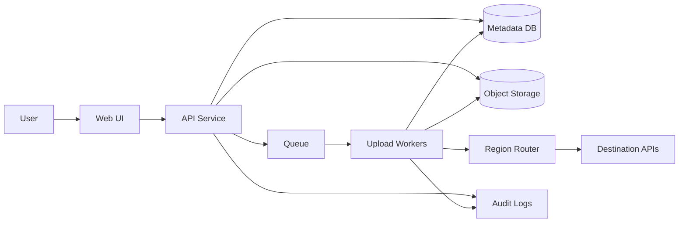

# Technical Design Document (TDD)
## DocBridge
TDD-001 | Status: Draft | Owner: Liam/Payman | Last Updated: June 2026

---

# 1. Purpose

This document translates the approved DocBridge Blueprint (PAS-001) into a technical implementation design.

It defines:

- System architecture
- Component responsibilities
- Data model
- Processing workflows
- Security controls
- Scalability approach
- Failure handling
- Operational considerations

This document is intended for engineers, architects, reviewers, and future contributors.

---

# 2. System Overview

DocBridge is a standalone upload orchestration platform that enables users to:

- Upload documents once
- Map documents to multiple destinations
- Submit a batch upload job
- Track progress across all destinations
- Recover from failures without repeating successful uploads

The platform acts as an orchestration layer above existing document management systems.

---

# 3. High-Level Architecture

| Component | Responsibility |
|------------|----------------|
| Web UI | Upload files and monitor progress |
| API Service | Job orchestration and metadata management |
| Object Storage | Temporary encrypted file storage |
| Queue Service | Async task execution |
| Upload Workers | Perform destination uploads |
| Region Router | Select destination endpoint |
| Metadata Database | Jobs, tasks, status tracking |
| Audit Logging | Immutable operational records |
| Authentication Provider | User identity and authorization |

---

# 4. Architecture Principles

| Principle | Description |
|------------|-------------|
| Async First | Long-running uploads never block users |
| Stateless Services | APIs scale horizontally |
| Failure Isolation | One upload failure does not impact others |
| Idempotent Processing | Safe retries and recovery |
| Security by Default | Encryption and least privilege |
| Observable Systems | Full audit and tracing support |

## 4.1 DocBridge High Level Diagram

## 4.2 Cloud Service Mapping 

| Architecture Block | Purpose | Recommended AWS Service | Recommended Google Cloud Equivalent |
|---|---|---|---|
| Web UI | User-facing interface for uploading files, selecting destinations, and tracking progress | Amazon CloudFront + S3 Static Website Hosting or AWS Amplify | Firebase Hosting or Cloud Storage + Cloud CDN |
| API Service | Handles job creation, validation, metadata updates, and status retrieval | Amazon ECS / AWS Fargate or AWS Lambda + API Gateway | Cloud Run or Cloud Functions + API Gateway |
| Authentication Provider | Delegated identity and access control | Amazon Cognito or IAM Identity Center | Firebase Authentication or Identity Platform |
| Object Storage | Temporary encrypted storage for uploaded files before processing | Amazon S3 | Cloud Storage |
| Metadata Database | Stores jobs, tasks, file metadata, status, retries, and audit references | Amazon DynamoDB or Amazon RDS | Firestore, Cloud Spanner, or Cloud SQL |
| Queue | Decouples job submission from async upload execution | Amazon SQS | Pub/Sub or Cloud Tasks |
| Upload Workers | Consume tasks, retrieve files, upload to destinations, validate results, and update status | ECS/Fargate Workers, AWS Lambda, or AWS Batch | Cloud Run Jobs, Cloud Functions, or GKE |
| Region Router | Resolves destination endpoint, region, tenant, and routing rules | Lambda, ECS Service, or config-backed service using DynamoDB/AppConfig | Cloud Run service using Firestore/Config Controller |
| Destination APIs | External hospital, binder, or document-management-system APIs | External integration endpoint | External integration endpoint |
| Audit Logs | Immutable structured logs for traceability and compliance | CloudWatch Logs, CloudTrail, or S3 log archive | Cloud Logging, Cloud Audit Logs, or Cloud Storage archive |
| Secrets Management | Stores API credentials, tokens, and destination secrets | AWS Secrets Manager or Parameter Store | Secret Manager |
| Encryption / Key Management | Manages encryption keys for files, metadata, and secrets | AWS KMS | Cloud KMS |
| Monitoring & Metrics | Tracks queue depth, upload latency, failures, retries, and system health | Amazon CloudWatch | Cloud Monitoring |
| Distributed Tracing | Traces requests across API, queue, workers, and destination calls | AWS X-Ray | Cloud Trace |
| Dead Letter Queue | Holds failed tasks after retry exhaustion | SQS DLQ | Pub/Sub dead-letter topic or Cloud Tasks retry/dead-letter pattern |
| CI/CD Pipeline | Builds, tests, scans, and deploys services | GitHub Actions + AWS CodePipeline/CodeBuild | GitHub Actions + Cloud Build |

---

# 5. Functional Flow

## Upload Flow

1. User uploads files
2. Files stored in temporary object storage
3. Metadata validated
4. Job created
5. Upload tasks generated
6. Tasks pushed to queue
7. Workers process uploads
8. Destination APIs receive files
9. Results recorded
10. Job status recalculated

---

# 6. Component Design

## 6.1 Web UI

### Responsibilities

- File upload
- Destination selection
- Batch submission
- Progress monitoring
- Error visibility

### Non-Responsibilities

- File processing
- Upload execution
- Authentication ownership

---

## 6.2 API Service

### Responsibilities

- Authentication validation
- Metadata validation
- Job creation
- Task generation
- Status retrieval

### APIs

| Endpoint | Method | Purpose |
|-----------|---------|----------|
| /jobs | POST | Create upload job |
| /jobs/{id} | GET | Retrieve job status |
| /jobs/{id}/tasks | GET | Retrieve task details |
| /files/upload | POST | Upload file |
| /health | GET | Health check |

---

## 6.3 Object Storage

### Purpose

Temporary staging area for uploaded files.

### Requirements

| Requirement | Description |
|-------------|-------------|
| Encryption | AES-256 at rest |
| Versioning | Enabled |
| Lifecycle Rules | Automatic cleanup |
| Durability | Multi-AZ storage |

### AWS Example

- Amazon S3

---

## 6.4 Queue Layer

### Purpose

Decouple submission from execution.

### Responsibilities

- Task buffering
- Retry handling
- Work distribution

### AWS Example

- Amazon SQS

---

## 6.5 Upload Workers

### Responsibilities

- Consume tasks
- Retrieve files
- Determine destination
- Upload files
- Validate upload
- Record result

### Scaling

Workers scale independently based on queue depth.

---

## 6.6 Region Router

### Responsibilities

Determine correct destination endpoint.

### Example Inputs

| Parameter | Example |
|------------|----------|
| Hospital | UCLA |
| Region | US-West |
| Binder | Regulatory |

### Output

Target API endpoint and credentials.

---

# 7. Data Model

## Job

| Field | Type |
|---------|------|
| JobId | UUID |
| UserId | String |
| Status | Enum |
| CreatedAt | Timestamp |
| UpdatedAt | Timestamp |

### Status Values

- Pending
- Processing
- Completed
- PartialSuccess
- Failed

---

## Task

| Field | Type |
|---------|------|
| TaskId | UUID |
| JobId | UUID |
| FileId | UUID |
| DestinationId | String |
| Status | Enum |
| RetryCount | Integer |
| Checksum | String |

### Status Values

- Pending
- Processing
- Completed
- Failed

---

## File Metadata

| Field | Type |
|---------|------|
| FileId | UUID |
| OriginalName | String |
| StoragePath | String |
| FileSize | Long |
| SHA256 | String |

---

# 8. Processing Lifecycle

| Step | Description |
|--------|-------------|
| 1 | File uploaded |
| 2 | File stored |
| 3 | Metadata validated |
| 4 | Job created |
| 5 | Tasks generated |
| 6 | Queue populated |
| 7 | Worker execution |
| 8 | Destination upload |
| 9 | Validation |
| 10 | Status persisted |

---

# 9. Security Design

## Authentication

Delegated to enterprise identity provider.

Examples:

- Active Directory
- Azure AD
- Okta

---

## Authorization

Permission-aware destination access.

Users only see locations they can access.

---

## Encryption

| Layer | Strategy |
|---------|-----------|
| At Rest | S3 + KMS |
| In Transit | TLS 1.2+ |
| Secrets | Secrets Manager |

---

## Integrity

Every upload includes:

- SHA256 checksum before upload
- SHA256 validation after upload

---

## Auditability

Every action generates immutable logs.

Examples:

- Job created
- Task submitted
- Upload completed
- Upload failed

---

# 10. Reliability Design

## Retry Strategy

| Attempt | Delay |
|-----------|---------|
| 1 | Immediate |
| 2 | 30 sec |
| 3 | 2 min |
| 4 | 10 min |

Exponential backoff applied.

---

## Dead Letter Queue

Tasks exceeding retry limits move to DLQ.

AWS Example:

- SQS Dead Letter Queue

---

## Failure Isolation

Failures affect only:

- Individual task

Never:

- Entire job
- Other tasks

---

## Recovery

Workers are idempotent.

Tasks can be replayed safely.

---

# 11. Scalability Design

## Initial Assumptions

| Metric | Estimate |
|-----------|------------|
| Users | Hundreds |
| Jobs/Day | Thousands |
| Files/Day | Tens of Thousands |
| Concurrent Uploads | Hundreds |

---

## Horizontal Scaling

| Component | Scaling Method |
|------------|---------------|
| API | Load Balancer |
| Workers | Auto Scaling |
| Queue | Managed Service |
| Storage | Managed Service |

---

# 12. Observability

## Metrics

| Metric | Description |
|----------|-------------|
| Jobs Created | Volume |
| Queue Depth | Backlog |
| Upload Success Rate | Reliability |
| Upload Latency | Performance |
| Retry Count | Stability |

---

## Logging

Structured JSON logs.

Required fields:

- CorrelationId
- JobId
- TaskId
- UserId
- Timestamp

---

## Tracing

Distributed tracing across:

- API
- Queue
- Worker
- Destination

---

# 13. Deployment Strategy

## Environment Structure

| Environment | Purpose |
|-------------|---------|
| Dev | Development |
| Test | Validation |
| Stage | Pre-production |
| Prod | Production |

---

## CI/CD

Pipeline Stages:

1. Build
2. Unit Tests
3. Security Scan
4. Integration Tests
5. Deploy

---

# 14. Open Questions

| Question | Owner |
|------------|---------|
| Destination API rate limits? | TBD |
| Maximum supported file size? | TBD |
| Retention policy duration? | TBD |
| Multi-region requirement? | TBD |
| Virus scanning requirement? | TBD |

---

# 15. Future Enhancements

- Event-driven architecture
- Multi-region failover
- Bulk retry operations
- Upload prioritization
- Real-time notifications
- Destination-specific adapters
- Analytics dashboard

---

# 16. Appendix

## AWS Reference Architecture

Frontend:
- CloudFront
- React

Backend:
- ECS / EKS
- API Gateway

Storage:
- Amazon S3

Messaging:
- Amazon SQS

Database:
- DynamoDB

Security:
- IAM
- KMS
- Secrets Manager

Observability:
- CloudWatch
- X-Ray
