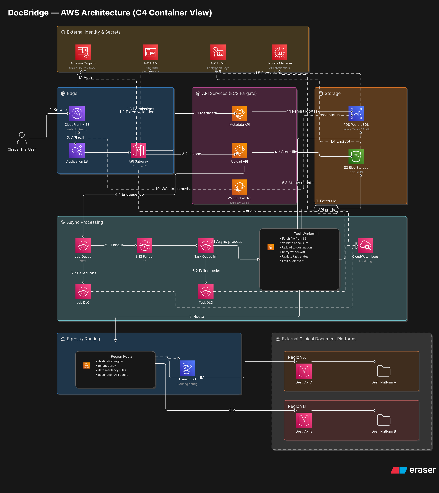

# DocBridge Architecture

A concise engineering reference for how DocBridge is built. For the business framing see
`blueprint/DocBridge-Blueprint.md`; for granular specs see
`tech-spec/DocBridge-Technical-Specification.md`; for the reasoning behind each choice see `adr/`.



## Overview

DocBridge is a **single Express API** (with an **in-process SQS worker**) that lets users upload
files once and fan them out to many destinations, tracking each file-to-destination delivery
independently.

- **Frontend:** React + Vite SPA, served from S3 behind CloudFront. Authenticates via Cognito.
- **API:** Express (TypeScript) on ECS Fargate, behind an ALB. Owns jobs/tasks; coordinates
  uploads; serves status over WebSocket + polling.
- **Worker:** in-process SQS long-poll consumer, deployed as a second Fargate service from the
  same image. Delivers files to destinations.
- **Data:** RDS PostgreSQL (jobs/tasks/metadata, migrate-on-startup); S3 (SSE-KMS staging);
  DynamoDB (routing config).
- **Messaging:** SQS task + job queues, each with a DLQ.
- **Destinations:** two mock Lambda receivers (region-a, region-b).
- **Identity:** Cognito user pool; the API verifies JWTs (transitional `x-user-id` dev fallback).

## Request/delivery flow

```
Browser → CloudFront → ALB → Express API
  presign → PUT to S3 → confirm → create job+tasks → submit
                                                   ↓ (SQS task messages)
                                             In-process Worker
                                               → resolve destination (DynamoDB)
                                               → download from S3 (≤100MB)
                                               → verify SHA-256
                                               → POST to destination (region A/B Lambda)
                                               → update task/job status (PostgreSQL)
                                               → WebSocket push to UI
```

See `tech-spec/DocBridge-Technical-Specification.md` for the endpoint table and delivery
outcomes, and `../implementation/api/src/services/delivery-service.ts` for the delivery code.

## Infrastructure (AWS CDK — 8 stacks)

Defined in `implementation/infra/lib`, composed in `bin/infra.ts`:

| Stack | Resources |
|---|---|
| Networking | VPC (2 AZ, NAT), security groups |
| Auth | Cognito user pool + app client |
| Storage | S3 (SSE-KMS), RDS PostgreSQL |
| Messaging | SQS task/job queues + DLQs |
| Routing | DynamoDB routing table |
| Compute | ECS cluster, API + Worker Fargate services |
| Edge | ALB, CloudFront (+ WebSocket) |
| MockDestination | 2 Lambda destinations (region-a, region-b) |

**Environments:** one AWS account, two environments via env-suffixed stacks
(`DocBridge-dev-*`, `DocBridge-prod-*`), selected with `cdk … -c env=dev|prod` (ADR-0011).

## Key decisions (ADRs)

| Area | Choice | ADR |
|---|---|---|
| Service decomposition | Single Express service | ADR-0004 |
| Worker compute | In-process (ECS), not Lambda | ADR-0005 |
| Queue | SQS + DLQ | ADR-0006 |
| IaC | AWS CDK | ADR-0007 |
| Database | Single PostgreSQL, migrate-on-startup | ADR-0008 |
| Encryption at rest | S3 SSE-KMS | ADR-0009 |
| Routing config | DynamoDB | ADR-0010 |
| Auth | Cognito JWT (+ dev fallback) | ADR-0003 |
| Status delivery | WebSocket + polling | ADR-0013 |
| Environments/CI/CD | Dev/Prod, one account | ADR-0011 |
